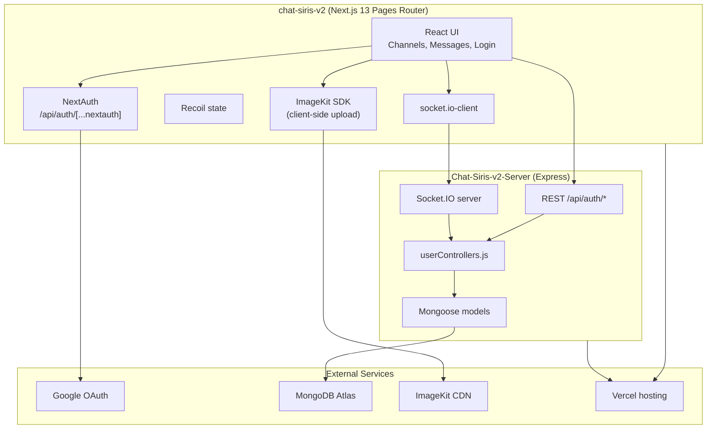

# Technical Specification — Chat-Siris v2

> **Document type:** Reverse-engineered from code (code-first).  
> **Scope:** `chat-siris-v2` (Next.js client) + `Chat-Siris-v2-Server` (Express + Socket.IO API).  
> **Legend:** **[Confirmed]** — directly observed in repo/config. **[Inferred]** — reasonable conclusion from code paths. **Unknown / Needs confirmation** — not derivable from code.

---

## 1. Overview

### 1.1 Problem Statement

**[Confirmed]** Chat-Siris v2 is a real-time group chat web application (DevChallenges submission, successor to [chat-siris-v1](https://chat-siris-v1.vercel.app)). Users authenticate with Google, join public or password-protected channels, exchange text and rich media (images, video, audio, PDF, ZIP, code/doc files), and manage profiles (avatar, background, display name).

Without this system, users would lack a persistent, multi-user channel chat with media storage and live message delivery.

### 1.2 Goals

| Goal | Source | Status |
|------|--------|--------|
| Google OAuth login | README user story #1 | **[Confirmed]** via NextAuth |
| Send/receive messages in channels | README #2 | **[Confirmed]** REST + Socket.IO |
| Profile editing (name, avatar, background) | README #3 | **[Confirmed]** |
| Message deletion (channel admin) | README #4 | **[Confirmed]** client-gated; server unauthenticated |
| Custom REST API backend | README #5 | **[Confirmed]** Express on `/api/auth/*` |
| Fast media sharing via CDN | README | **[Confirmed]** ImageKit uploads from client |

### 1.3 Non-Goals (observed in code)

- **[Confirmed]** No native mobile app; web-only Next.js SPA.
- **[Confirmed]** No offline mode or message queue/retry.
- **[Confirmed]** No formal API versioning (`/api/v1/...`); routes live under `/api/auth/`.
- **[Confirmed]** Tradity/subscribe/image-gallery backend routes exist but are **not wired** in the frontend `ApiRoutes.js` — treated as legacy or separate feature surface.
- **Unknown / Needs confirmation:** Production SLOs, rate limits, data retention policy.

---

## 2. High-Level Design

### 2.1 Architecture Diagram



**[Confirmed]** Text equivalent:

```text
[ Browser — Next.js client ]
    |  Google OAuth (NextAuth)
    |  axios → REST /api/auth/*
    |  socket.io-client → real-time events
    |  ImageKit SDK → media CDN
    v
[ Express + Socket.IO server (port 3333) ]
    |  Mongoose
    v
[ MongoDB Atlas ]
```

### 2.2 Critical User Flows

#### Flow A — Login / registration

1. **[Confirmed]** User visits `/login`, clicks Google sign-in (`next-auth` `GoogleProvider`).
2. **[Confirmed]** On session, client POSTs `{ email }` to `/api/auth/login`.
3. **[Confirmed]** If `status: false`, client POSTs register payload (`username`, `email`, `avatarImage`, `isAvatarImageSet`) to `/api/auth/register`.
4. **[Confirmed]** User stored in Recoil `currentUserState`; redirect to `/`.
5. **[Confirmed]** Home page redirects to `/login` if no NextAuth session.

#### Flow B — Join channel & chat

1. **[Confirmed]** Public channels: GET `/api/auth/getAllChannels` (`privacy: false` only).
2. **[Confirmed]** Private channels: POST `/api/auth/findChannelRoute` with search substring.
3. **[Confirmed]** Optional password check is **client-only** (`ChannelCard.js` compares plaintext password).
4. **[Confirmed]** Join updates `Groups.users` via POST `/api/auth/addUserToChannel/:id` and `Users.inChannel` via POST `/api/auth/addChannelToUser/:id`.
5. **[Confirmed]** Socket emits `addUserToChannel`; server joins socket room named `channelRef.name`.
6. **[Confirmed]** Send message: POST `/api/auth/sendMessage` persists to MongoDB, then socket `add-msg` broadcasts `msg-recieve` to room.
7. **[Confirmed]** Peers load history via POST `/api/auth/getMessages` on `fetchMessages` socket event.

#### Flow C — Media message

1. **[Confirmed]** Client reads file as data URL, uploads to ImageKit (folder paths like `Audios`, `Videos`, `Pdfs`, `Zips`, `Codes`).
2. **[Confirmed]** Resulting CDN URL stored as `message.text` via same `sendMessage` endpoint.
3. **[Confirmed]** `MessageCard.js` renders by URL prefix heuristics.

#### Flow D — Delete message (admin)

1. **[Confirmed]** UI shows delete control only when `channelAdmin` Recoil flag is true (set when `currentChannel.adminId === currentUser._id`).
2. **[Confirmed]** POST `/api/auth/deleteMessage` with `{ id }` — **no server-side admin check**.
3. **[Confirmed]** Socket `refetchMessages` triggers all room clients to reload messages.

---

## 3. System Components & Responsibilities

| Module | Repo path | Responsibility |
|--------|-----------|----------------|
| **Entry / routing** | `chat-siris-v2/pages/` | `/` chat shell, `/login` auth, `/check` touch POC (unused in prod flow) |
| **NextAuth** | `pages/api/auth/[...nextauth].js` | Google OAuth session; JWT secret |
| **API route map** | `utils/ApiRoutes.js` | Backend base URL + path constants |
| **Socket client** | `service/socket.js` | Singleton `socket.io-client` to `NEXT_PUBLIC_SERVER_BASE` |
| **Channels UI** | `components/Channels.js`, `ChannelCard.js` | Channel list, search, join/leave, admin-only toggle |
| **Messages UI** | `components/Messages.js`, `MessageCard.js` | Compose, media upload, realtime receive, delete |
| **Global state** | `atoms/userAtom.js` | Recoil atoms (user, channel, messages, loaders) |
| **HTTP server** | `Chat-Siris-v2-Server/index.js` | Express bootstrap, Mongo connect, Socket.IO |
| **REST routes** | `routes/userRoutes.js` | Maps paths → controllers |
| **Business logic** | `controllers/userControllers.js` | All CRUD handlers |
| **Persistence** | `models/*.js` | Mongoose schemas |

---

## 4. API Resources

**[Confirmed]** Base path: `/api/auth` (mounted in `index.js`).  
**[Confirmed]** Response envelope (non-standard): `{ status: boolean, data? | user? | group? | obj? | msg? }` — **camelCase** keys.  
**[Confirmed]** No structured error codes; failures often propagate via Express `next(ex)` without a registered error handler.

| # | Resource | Endpoint | POST | GET | Status / notes |
|---|----------|----------|------|-----|----------------|
| 1 | Auth lookup | `/api/auth/login` | ✅ | - | 200 JSON; `{ status, user }` or `{ status:false, msg }` |
| 2 | User register | `/api/auth/register` | ✅ | - | 201-style 200; `{ status, user }` |
| 3 | Channel create | `/api/auth/createChannel` | ✅ | - | `{ status, group }` |
| 4 | Public channels | `/api/auth/getAllChannels` | - | ✅ | `{ status, data }` where `privacy:false` |
| 5 | Messages | `/api/auth/sendMessage` | ✅ | - | `{ status, data }` |
| 6 | Message history | `/api/auth/getMessages` | ✅ | - | body `{ group }`; sorted by `updatedAt` |
| 7 | Channel members | `/api/auth/addUserToChannel/:id` | ✅ | - | `{ status, obj }` |
| 8 | User channel | `/api/auth/addChannelToUser/:id` | ✅ | - | `{ status, obj }` |
| 9 | User profile | `/api/auth/updateUser/:id` | ✅ | - | `{ inChannel, admin }` |
| 10 | Room lookup | `/api/auth/fetchUserRoom` | ✅ | - | `{ status, data }` by channel name |
| 11 | Background | `/api/auth/deleteBackground/:id` | ✅ | - | Updates `backgroundImage` |
| 12 | Display name | `/api/auth/updateName/:id` | ✅ | - | Updates `username` |
| 13 | Avatar | `/api/auth/updateAvatar/:id` | ✅ | - | Updates `avatarImage` |
| 14 | Private search | `/api/auth/findChannelRoute` | ✅ | - | `{ name }` substring; `privacy:true` |
| 15 | Delete message | `/api/auth/deleteMessage` | ✅ | - | `{ id }` → `deleteOne` |
| 16 | Admin-only chat | `/api/auth/channelAdminUpdate/:id` | ✅ | - | `{ adminOnly }` |
| 17 | Tradity messages | `/api/auth/tradity` | - | ✅ | Fixed group `tradityImg` — **not used by main UI** |
| 18 | Subscribe | `/api/auth/subscribe` | ✅ | - | **Legacy** |
| 19–22 | Tradity users/images | `/tradityusercheck`, `/tradityusercreate`, `/addtradityimage`, etc. | mixed | **Legacy** |

### 4.1 Apidog / OpenAPI cross-check

**[Confirmed]** Apidog project **"Microservice module"** (`core-apidog-mcp-server_read_project_oas`) documents EI internal APIs (`/api/content/v1/...`, pairing jobs, etc.). **No Chat-Siris v2 endpoints found.**

| Source | Chat-Siris contract |
|--------|---------------------|
| Apidog OAS | **Not maintained** for this app |
| Code (`userRoutes.js` + `ApiRoutes.js`) | **Authoritative** for HTTP contract |

### 4.2 Socket.IO events

| Event | Direction | Payload | Purpose |
|-------|-----------|---------|---------|
| `add-user` | C→S | `userId` | Track online user in `global.onlineUsers` Map |
| `addUserToChannel` | C→S | `channelRef` | Join room `channelRef.name`; broadcast `channelUpdate` |
| `RemoveUserFromChannel` | C→S | `channelRef` | Leave room; broadcast `channelUpdate` |
| `add-msg` | C→S | `{ group, data }` | Broadcast `msg-recieve` to room |
| `refetchChannels` | C→S | — | Broadcast `fetch` to all |
| `refetchMessages` | C→S | `{ group }` | Room emit `fetchMessages` |
| `channelUpdate` | C→S | channel object | Room emit `channelDetailsUpdate` |
| `add-member` | C→S | `{ channelName, members }` | **[Bug]** uses undefined `room` variable — likely broken |

**[Confirmed]** CORS origin for Socket.IO: `https://chat-siris-v2.vercel.app` only (`index.js`).

---

## 5. Authentication & Authorization

### 5.1 Authentication boundaries

| Layer | Mechanism | **[Confirmed]** behavior |
|-------|-----------|--------------------------|
| **Frontend route guard** | NextAuth session on `/` | Redirect to `/login` if no session |
| **Backend REST** | None | All `/api/auth/*` routes are **public**; no JWT/session validation |
| **Backend Socket.IO** | None | Any client can connect and emit events |
| **Identity binding** | Email from Google → MongoDB `Users` | Client sends `email`/`userId` in body; server trusts caller |

### 5.2 Authorization (client-enforced only)

| Action | Client check | Server check |
|--------|--------------|--------------|
| Join password channel | Plaintext password match | **[Confirmed]** None |
| Admin-only messaging | `adminOnly` + `adminId !== currentUser._id` blocks input | **[Confirmed]** None on `sendMessage` |
| Delete message | `channelAdmin` UI flag | **[Confirmed]** None on `deleteMessage` |
| Toggle admin-only | Channel creator UI | **[Confirmed]** None on `channelAdminUpdate` |

**[Inferred]** Any HTTP client can impersonate users, post to any channel, delete any message, or mutate any user/channel by ID.

---

## 6. Database Design

**[Confirmed]** MongoDB via Mongoose 6.x. Connection string is **hardcoded** in `Chat-Siris-v2-Server/index.js` (not env-driven). Database name not specified in URI — uses Atlas default DB for credentials.

**[Confirmed]** `ei-database-mcp-server` lists PostgreSQL corporate databases only; **no MongoDB/chat-siris connection** available for live schema introspection. Collections below are from Mongoose models only.

### 6.1 Collections (Mongoose → Mongo collection names)

| Collection | Model file | Key fields | Indexes / constraints |
|------------|------------|------------|------------------------|
| `users` | `userModel.js` | `username` (unique), `email` (unique, required), `avatarImage`, `isAvatarImageSet`, `admin`, `inChannel`, `backgroundImage` | Unique on username, email |
| `groups` | `groupModel.js` | `name`, `admin`, `adminId`, `description`, `password`, `privacy`, `users[]`, `adminOnly` | None declared |
| `messages` | `messageModel.js` | `group` (channel name string), `message.text`, `byUserName`, `byUserImage` | None declared |
| `subscribes` | `subscribeModel.js` | `gmail` | Legacy |
| `tradityusers` | `tradityUserModel.js` | `gmail`, `name` | Legacy |
| `images` | `imageModel.js` | `link`, `title`, `description` | Legacy Tradity gallery |

**[Confirmed]** Message query pattern: `Message.find({ group: { $all: group } })` where `group` is a string channel name from client — effectively string equality via `$all` on a string coerced to array.

**[Confirmed]** Channel membership stored as embedded user objects in `Groups.users` array (denormalized snapshots, not references).

### 6.2 Migration plan

**Unknown / Needs confirmation.** No migration tooling, seed scripts, or schema versioning in repo.

---

## 7. External Integrations

| Service | Usage | Config |
|---------|-------|--------|
| **Google OAuth** | NextAuth provider | `GOOGLE_CLIENT_ID`, `GOOGLE_CLIENT_SECRET`, `JWT_SECRET`, `NEXTAUTH_URL` |
| **ImageKit** | Client-side media upload & CDN URLs in messages | `NEXT_PUBLIC_IMAGEKIT_*` (see §9 — private key exposed) |
| **MongoDB Atlas** | Primary datastore | Hardcoded URI in server `index.js` |
| **Vercel** | Hosting | Frontend: `chat-siris-v2.vercel.app`; backend: `chat-siris-v2-server.vercel.app` **[Inferred from comments/ CORS]** |
| **Socket.IO** | Real-time fan-out | `NEXT_PUBLIC_SERVER_BASE` on client |

---

## 8. Deployment & Runtime

### 8.1 Frontend (`chat-siris-v2`)

| Item | Value |
|------|-------|
| Framework | Next.js (pages router), React 18 |
| Scripts | `dev`, `build`, `start` — **[Confirmed]** no test/lint scripts |
| Package manager | npm (`package-lock.json`) |
| Node version | **Unknown / Needs confirmation** — no `engines` or `.nvmrc` |
| Hosting | Vercel **[Confirmed]** per README URL |
| `next.config.js` | `reactStrictMode: false`; ImageKit domain allowlist; CORS headers on `/api/*` |

### 8.2 Backend (`Chat-Siris-v2-Server`)

| Item | Value |
|------|-------|
| Runtime | Node.js + Express 4 |
| Process | `nodemon index.js` via `npm start` |
| Port | `process.env.PORT \|\| 3333` |
| Vercel | `vercel.json` — `@now/node` builder, catch-all route to `index.js` |
| dotenv | Commented out (`// require('dotenv').config()`) — env file not loaded by default |

---

## 9. Configuration & Secrets Touchpoints

| Variable | Component | Required | Notes |
|----------|-----------|----------|-------|
| `GOOGLE_CLIENT_ID` | NextAuth | Yes | Server-side |
| `GOOGLE_CLIENT_SECRET` | NextAuth | Yes | Server-side |
| `JWT_SECRET` | NextAuth | Yes | Session signing |
| `NEXTAUTH_URL` | NextAuth | Yes | OAuth callback base |
| `NEXT_PUBLIC_SERVER_BASE` | Socket + API host | Yes | Dev: `http://localhost:3333/`; prod comment: Vercel server URL |
| `NEXT_PUBLIC_IMAGEKIT_ID` | ImageKit | Yes | Public key |
| `NEXT_PUBLIC_IMAGEKIT_PRIVATE` | ImageKit | Yes | **Security gap:** private key prefixed `NEXT_PUBLIC_` → bundled to browser |
| `NEXT_PUBLIC_IMAGEKIT_ENDPOINT` | ImageKit | Yes | CDN base URL |
| `PORT` | Express | Optional | Default 3333 |
| MongoDB URI | Server | Yes | **Security gap:** hardcoded in source, not env var |

**[Confirmed]** Local dev mismatch risk: `ApiRoutes.js` hardcodes `host = "http://localhost:3333"` while socket uses `NEXT_PUBLIC_SERVER_BASE`.

---

## 10. Observability, Testing & CI

### 10.1 Observability

**[Confirmed]** Logging is `console.log` only (server socket handlers, some controllers). No structured logging, correlation IDs, metrics, or health endpoints beyond `GET /` returning HTML `"Hello"`.

### 10.2 Testing & CI

| Item | Status |
|------|--------|
| Unit / integration tests | **None** — server `npm test` is placeholder exit 1 |
| E2E tests | **None** |
| GitHub Actions / CI | **None** in workspace |
| Contract tests / API snapshots | **None** |
| Apidog parity | N/A — OAS not maintained for this service |

**[Inferred]** Regression safety relies entirely on manual testing.

---

## 11. Failure Modes & Error Handling

| Failure | Observed behavior | Severity |
|---------|-------------------|----------|
| Unhandled controller exception | `next(ex)` with **no Express error middleware** → likely default 500/HTML | **[Confirmed]** High |
| MongoDB connection failure | Logged in catch; server still starts listening | **[Confirmed]** Medium — API calls fail at runtime |
| Login email not found | `{ status: false, msg: "Account need to be Regitered" }` | **[Confirmed]** |
| Duplicate username/email on register | Mongoose unique index error → unhandled unless caught | **[Inferred]** |
| Socket disconnect | No reconnect/backoff logic in `socket.js` | **[Confirmed]** |
| ImageKit upload failure | Toast/console only; message not sent | **[Confirmed]** |
| Wrong channel password | Client toast `'Password Wrong'` | **[Confirmed]** |
| `add-member` socket handler | References undefined `room` — runtime error on emit | **[Confirmed]** Bug |
| Multi-tab / stale Recoil state | Session in NextAuth but Recoil cleared on refresh | **[Inferred]** User must re-login flow via `/login` |
| CORS / socket origin mismatch | Non-production origins blocked by server CORS | **[Confirmed]** for local dev unless CORS updated |

---

## 12. Key Decisions (as implemented)

| Decision | Chosen approach | Rationale (inferred) | Gap vs ideal |
|----------|-----------------|----------------------|--------------|
| Auth split | NextAuth on client; backend trust-by-payload | Rapid DevChallenge delivery | Backend should validate session/JWT |
| Real-time | Socket.IO rooms named by channel | Simple broadcast model | No auth on socket; no persistence ack |
| Media storage | ImageKit direct from browser | Fast uploads, CDN delivery | Private key exposure; no server-side virus scan |
| Data store | MongoDB + embedded channel members | Flexible schema for chat prototype | Denormalization complicates membership sync |
| API shape | Ad-hoc `{ status, data }` JSON | Minimal contract | No versioning, error codes, or OpenAPI |
| Channel privacy | `privacy` boolean filter on list endpoints | Public vs private channel split | Private discovery via substring search only |
| Password channels | Plaintext password in MongoDB + client check | Simplicity | No hashing; no server enforcement |

---

## 13. Non-Functional Requirements

| Category | Target in code | Notes |
|----------|----------------|-------|
| Performance | **Unknown** | No benchmarks; client-side media size cap 16MB for video |
| Scalability | Single Node process + in-memory `onlineUsers` Map | **[Confirmed]** Not multi-instance safe |
| Availability | **Unknown** | No health checks or redundancy |
| Security | Google OAuth for UI only | Critical gaps: open API, exposed secrets, plaintext passwords |
| Observability | Console logs | No APM/tracing |

---

## 14. Known Gaps vs Ideal Design

1. **[Confirmed] No backend authentication/authorization** on REST or WebSocket.
2. **[Confirmed] MongoDB credentials hardcoded** in `index.js`.
3. **[Confirmed] ImageKit private key in `NEXT_PUBLIC_*`** env var — visible in client bundle.
4. **[Confirmed] Channel passwords stored and compared in plaintext**.
5. **[Confirmed] No global error handler** despite widespread `next(ex)`.
6. **[Confirmed] `ApiRoutes.js` host hardcoded** to localhost; production URL commented — easy misconfiguration.
7. **[Confirmed] Socket `add-member` bug** (`room` undefined).
8. **[Confirmed] Delete message / admin-only** enforced in UI only.
9. **[Confirmed] No tests, CI, or API contract documentation** in Apidog.
10. **[Inferred] `onlineUsers` map** never cleaned on disconnect (`add-user` only).
11. **[Inferred] Message deletion** optimistically hides in UI (`MessageCard` `deleted` state) before server ack.
12. **Unknown:** Backup strategy, GDPR/data deletion, message pagination limits.

---

## 15. Rollout Plan

**Unknown / Needs confirmation.** No feature flags, canary config, or deployment runbooks in repo. Current production URLs:

- Web: `https://chat-siris-v2.vercel.app` **[Confirmed]**
- API: `https://chat-siris-v2-server.vercel.app` **[Inferred]** from `ApiRoutes.js` comment and socket CORS pairing

---

## 16. Risks & Mitigation

| Risk | Impact | Probability | Mitigation (recommended) |
|------|--------|-------------|--------------------------|
| Open API abuse | High | High | Add JWT/session middleware; validate user owns `:id` |
| Leaked DB credentials in git | High | Medium | Rotate credentials; move to env/secrets manager |
| Client-exposed ImageKit private key | High | High | Server-side upload proxy; server-only private key |
| Socket.IO single-instance state | Medium | Medium | Redis adapter for multi-instance; auth handshake |
| No tests | Medium | High | Add API integration tests + critical path E2E |
| Plaintext channel passwords | Medium | Medium | Hash server-side; enforce on join API |

---

## 17. Open Questions for Owner

1. Is MongoDB database name intentional default, or should a dedicated DB (e.g. `chat-siris`) be used?
2. Are Tradity/subscribe endpoints still required, or can they be deprecated?
3. What is the intended production API base URL strategy — env-only vs build-time constants?
4. Should channel admins be re-assignable, or is `adminId` immutable for life of channel?
5. Are there retention limits for messages/media URLs on ImageKit?

---

## 18. References

| Reference | Location |
|-----------|----------|
| Frontend repo | `chat-siris-v2/` |
| Backend repo | `Chat-Siris-v2-Server/` |
| README / user stories | `chat-siris-v2/README.md` |
| Apidog OAS (EI Microservice module) | Not applicable to Chat-Siris |
| Live app | https://chat-siris-v2.vercel.app |
| Challenge | https://devchallenges.io/challenges/UgCqszKR7Q7oqb4kRfI0 |

---

## Appendix A — Self-Review Notes (critical paths)

Self-review performed against auth, data writes, and error handling:

| Path | Review finding |
|------|----------------|
| **Auth** | NextAuth protects `/` client-side only; backend accepts anonymous writes — **spec updated to reflect no server auth** |
| **Data writes** | All mutations are unauthenticated POSTs; user/channel IDs taken from client body/params — **confirmed** |
| **Error handling** | No `app.use((err, req, res, next) => ...)` in `index.js`; errors from controllers are not normalized — **confirmed** |
| **Delete message** | Server does not verify requester is channel admin — **confirmed gap** |
| **Send message admin-only** | Server accepts messages regardless of `adminOnly` flag — **confirmed gap** |

---

*Generated by reverse-engineering codebase + ei-mcp-gateway skills (`techspec-from-code`, `technical-spec-writer`). Apidog OAS cross-check: no Chat-Siris endpoints. Database MCP: MongoDB not available; schema from Mongoose models only.*
