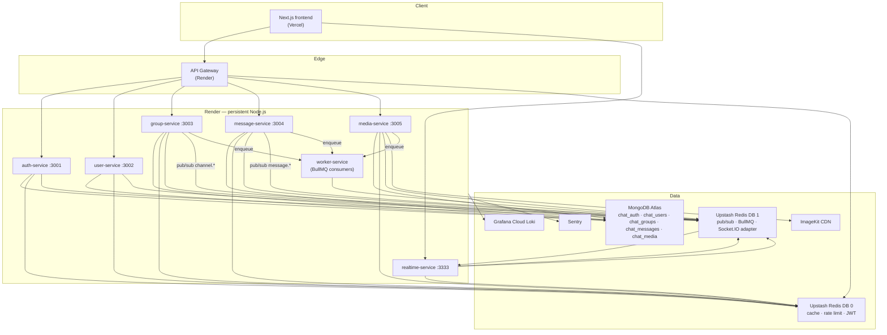
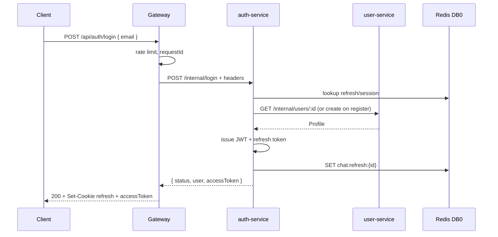
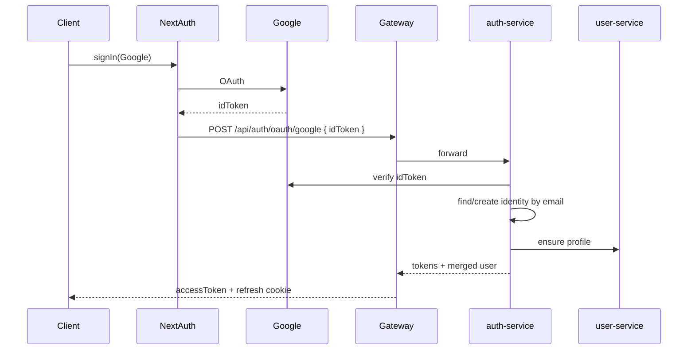
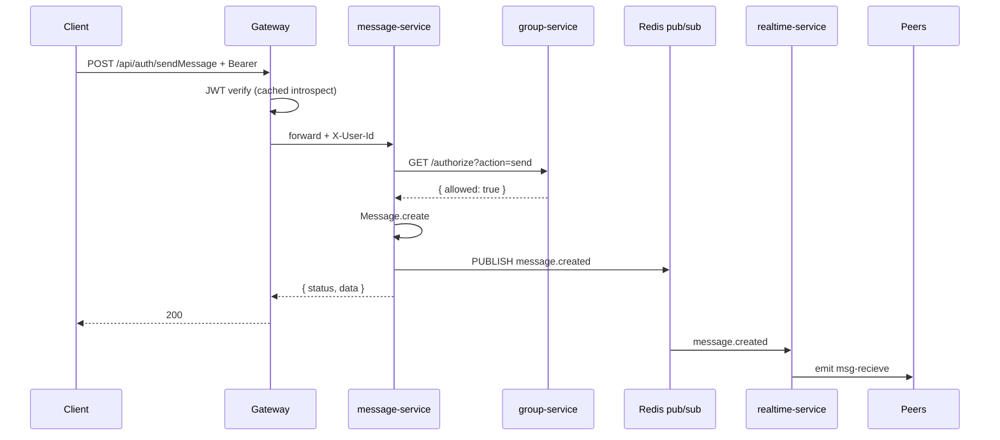
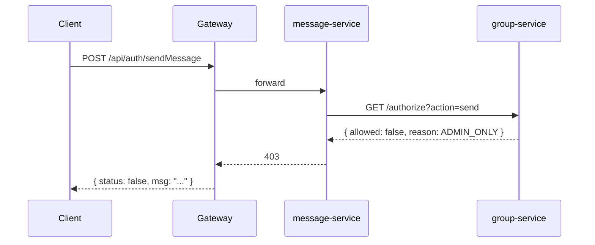
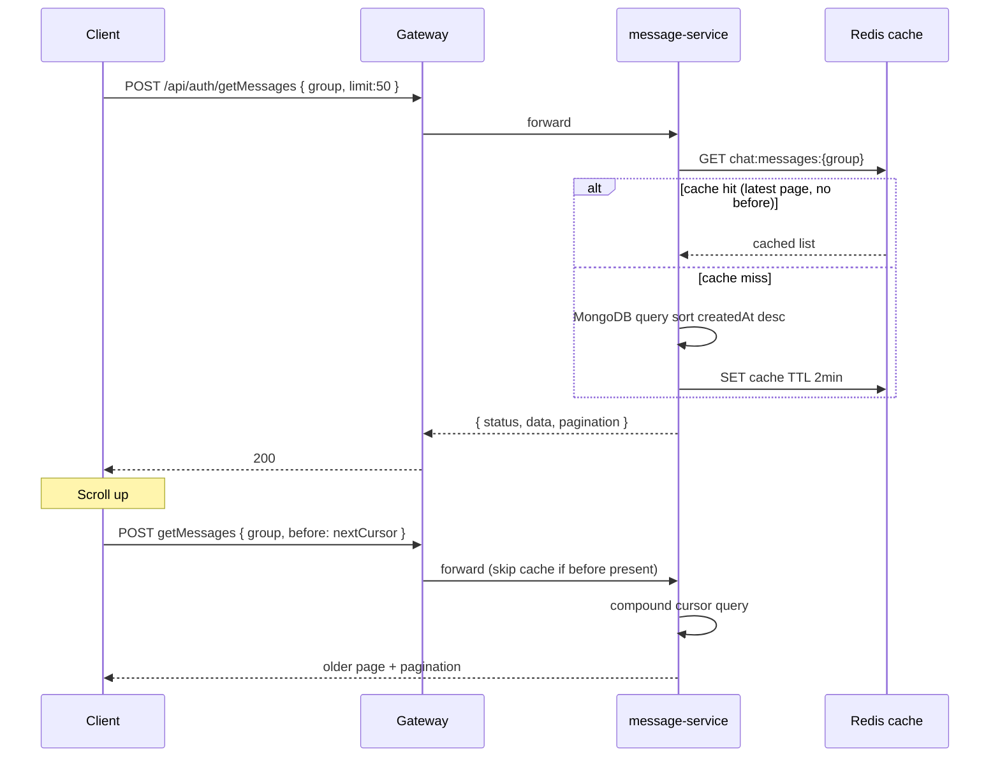
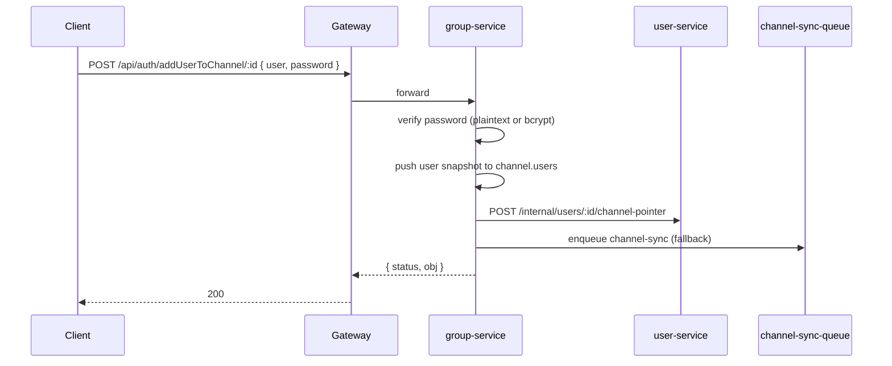
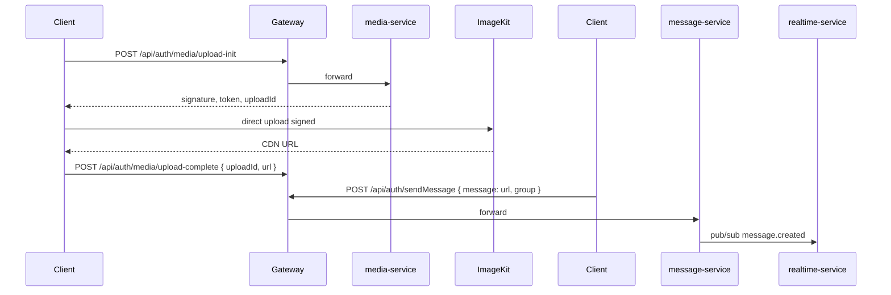
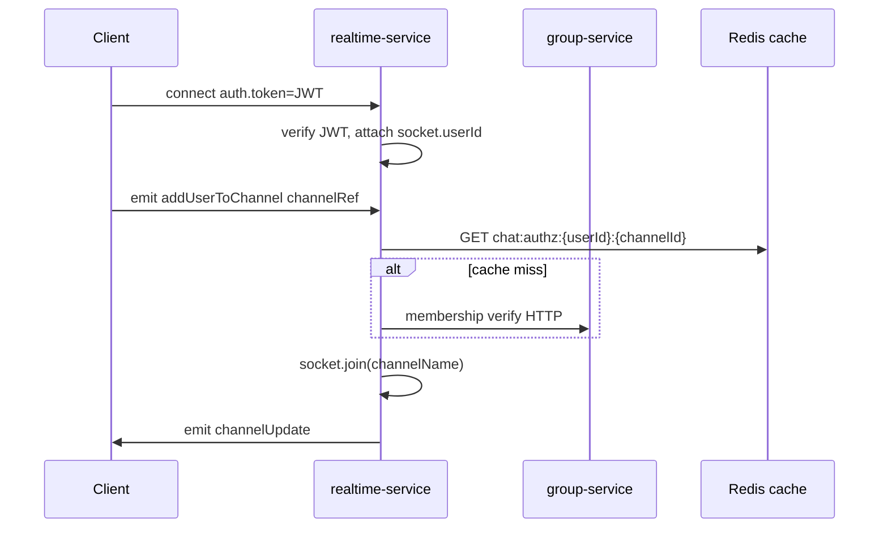
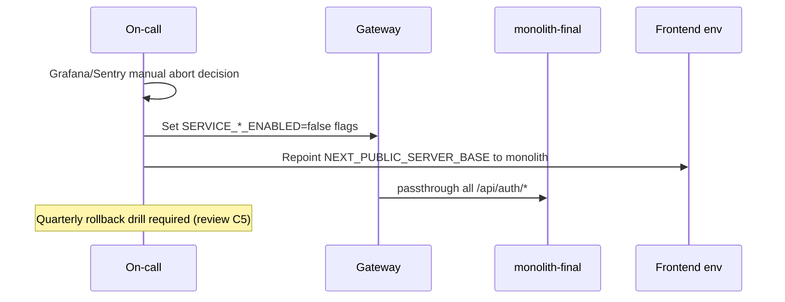

# Technical Specification — Chat-Siris v2 Microservices Migration

> **Document type:** Implementation-ready tech spec (derived from [`architecture-migration-plan.md`](./architecture-migration-plan.md) v1.1).  
> **Baseline:** [`tech-spec-old.md`](./tech-spec-old.md) (monolith reverse-engineered).  
> **Constraint:** Legacy REST paths `/api/auth/*` and Socket.IO event names preserved unless marked **breaking change**.

---

## 1. Overview

### 1.1 Problem Statement

The monolith (`Chat-Siris-v2-Server`) bundles auth, profiles, channels, messages, realtime, and legacy Tradity endpoints in one Express process. It has no server-side authentication, in-memory presence, client-only authorization, secrets in source/client bundle, and no horizontal scaling. Without migration, security gaps persist and realtime cannot scale independently of REST.

### 1.2 Goals

| Goal | Measurable target |
|------|-------------------|
| Security | JWT on all protected REST + Socket.IO; server-enforced channel authz; ImageKit signing server-side by Phase 4 |
| Scalability | Realtime + REST scale independently; Redis-backed presence and Socket.IO adapter |
| Backward compatibility | Legacy `/api/auth/*` paths and `{ status, data/user/group/obj }` envelope preserved |
| Operability | Structured logs + `requestId`; Sentry; `/health` with dependency checks; contract tests in CI |
| Delivery | 4 phases (~14 weeks); frontend + backend deploy together per phase; no post-release monolith traffic |

### 1.3 Non-Goals

- Tradity routes and `tradityusers` / `images` collections (removed)
- FCM/APNs push notifications (`notification-queue` log-only stub)
- Read receipts product feature (queue scaffold only)
- mTLS between services (deferred; HMAC internal token per review I2)
- Formal cost/SLO document (deferred I9)
- GDPR/compliance program (out of scope unless requirements emerge)
- Custom domain for gateway/socket (deferred decision #9)

---

## 2. High-Level Design

### 2.1 Target Architecture



### 2.2 Module Responsibilities

| Module | Repo (polyrepo) | Responsibility |
|--------|-----------------|----------------|
| **Next.js frontend** | `chat-siris-v2` | UI, NextAuth Google session, Recoil state, axios + socket client |
| **API Gateway** | `chat-siris-gateway` | Route proxy, JWT verify, rate limit, request ID, CORS, legacy path map |
| **auth-service** | `chat-siris-auth-service` | Login/register, Google token exchange, JWT issue/refresh/revoke/introspect |
| **user-service** | `chat-siris-user-service` | Profile CRUD, `inChannel` pointer, subscribe |
| **group-service** | `chat-siris-group-service` | Channel CRUD, membership, password verify, authz |
| **message-service** | `chat-siris-message-service` | Message CRUD, cursor pagination, pub/sub emit |
| **realtime-service** | `chat-siris-realtime-service` | Socket.IO, presence, room join, event fan-out |
| **media-service** | `chat-siris-media-service` | Upload-init signing, upload-complete, MIME/size validation |
| **worker-service** | `chat-siris-worker-service` | BullMQ consumers (notification, media, read-receipt, channel-sync) |
| **@chat-siris/logger** | `chat-siris-logger` (npm package) | Winston + Loki shared logger |
| **Monolith** | `Chat-Siris-v2-Server` | **Deleted at Phase 4** — tag `monolith-final`, read-only archive |

### 2.3 External Integrations

| Service | Used by | Purpose | Config |
|---------|---------|---------|--------|
| Google OAuth | Frontend (NextAuth), auth-service | Identity provider | `GOOGLE_CLIENT_ID`, `GOOGLE_CLIENT_SECRET` |
| MongoDB Atlas | All data services | Persistence | `MONGODB_URI` + `MONGODB_DB_NAME` per service |
| Upstash Redis | Gateway, all services, workers | Cache, rate limit, pub/sub, queues, Socket.IO adapter | `REDIS_CACHE_URL`, `REDIS_EVENTS_URL` (prod); `REDIS_URL` + `REDIS_DB_*` (local) |
| ImageKit | media-service, client (Phase 3a only) | CDN uploads | `IMAGEKIT_*` (server-only in target state) |
| Grafana Loki | All services | Log aggregation | `LOKI_HOST`, `LOKI_USER`, `LOKI_API_KEY` |
| Sentry | All services + workers | Error tracking | `SENTRY_DSN` |
| Vercel | Frontend | Hosting | Vercel project env |
| Render | Gateway + 7 backend services | Persistent Node hosting | Render env groups |

---

## 3. Global Contracts

### 3.1 Legacy Response Envelope (external REST)

All gateway-proxied `/api/auth/*` responses **must** preserve:

```typescript
type LegacyEnvelope<T> =
  | { status: true; data?: T; user?: T; group?: T; obj?: T; pagination?: PaginationMeta }
  | { status: false; msg: string };

type PaginationMeta = {
  hasMore: boolean;
  nextCursor: string | null; // base64url-encoded compound cursor
};
```

### 3.2 Internal Error Envelope (new `/internal/*`)

Internal services use structured errors (microservice-reviewer requirement):

```typescript
type InternalError = {
  error: {
    code: string;       // e.g. CHAT4010001
    message: string;
    details?: Record<string, unknown>;
    traceId: string;    // from X-Request-Id
  };
};
```

| HTTP | Code prefix | When |
|------|-------------|------|
| 400 | `CHAT400xxxx` | Validation failure |
| 401 | `CHAT401xxxx` | Missing/invalid auth |
| 403 | `CHAT403xxxx` | Authz denied |
| 404 | `CHAT404xxxx` | Resource not found |
| 409 | `CHAT409xxxx` | Duplicate (email, channel name) |
| 422 | `CHAT422xxxx` | Business rule violation |
| 429 | `CHAT429xxxx` | Rate limited |
| 500 | `CHAT500xxxx` | Unhandled exception |
| 503 | `CHAT503xxxx` | Dependency unavailable |

**Gateway external mapping:** Internal errors map to legacy `{ status: false, msg }` for client routes; `traceId` logged server-side only.

### 3.3 Gateway Identity Headers (downstream trust)

| Header | Type | Source | Required on protected routes |
|--------|------|--------|-------------------------------|
| `X-User-Id` | `ObjectId string` | JWT `sub` | Yes |
| `X-User-Email` | `string` | JWT `email` | Yes |
| `X-User-Role` | `"user" \| "admin"` | Profile `admin` field | Yes |
| `X-Request-Id` | `UUID v4` | Gateway-generated or client-provided | Always |
| `X-Auth-Jti` | `string` | JWT `jti` | When JWT present |
| `X-Internal-Signature` | `HMAC-SHA256 hex` | Gateway signs `timestamp + method + path` | Internal routes (review I2) |

**Invariant:** Internal services reject requests with identity headers unless `X-Internal-Signature` validates against `INTERNAL_HMAC_SECRET` and timestamp within ±60s.

### 3.4 Inter-Service HTTP Defaults

| Setting | Value |
|---------|-------|
| Timeout | 5s (authz), 10s (CRUD), 30s (media-init) |
| Retry | Idempotent GET only; max 2 retries; exponential backoff 100ms–1s + jitter |
| Circuit breaker | 5 failures / 30s → open 30s (use `opossum` or equivalent) |
| Trace propagation | W3C `traceparent` + OpenTelemetry (review I1) |

### 3.5 Redis Topology (review C4)

**Upstash (production):** Use two separate Redis instances — `REDIS_CACHE_URL` and `REDIS_EVENTS_URL`. Each instance uses DB index **0** only (`SELECT` / multi-DB is not supported on Upstash).

**Local Docker (development):** Single `REDIS_URL` with logical separation via DB index:

| Redis DB index | Env var | Contents |
|----------------|---------|----------|
| 0 | `REDIS_DB_CACHE=0` | JWT cache, rate limits, read caches, refresh tokens, presence |
| 1 | `REDIS_DB_EVENTS=1` | pub/sub channels, BullMQ, `@socket.io/redis-adapter` |

When `REDIS_CACHE_URL` or `REDIS_EVENTS_URL` is set, the corresponding client always uses `database: 0` / `db: 0`. `REDIS_URL` remains a deprecated fallback for local dev when dual URLs are unset.

**Degraded mode:**

| Dependency down | Gateway | auth-service | message-service | realtime-service |
|-----------------|---------|--------------|-----------------|------------------|
| Redis DB 0 | Rate limit fail-open with alert; JWT introspect direct to auth | Refresh tokens unavailable → 503 on refresh | Cache miss → MongoDB only | Presence stale TTL expiry |
| Redis DB 1 | N/A | N/A | Persist OK; no realtime fan-out → log error | Socket.IO single-instance only; queues stall → alert |
| MongoDB | 503 upstream | 503 login/register | 503 writes | Join denied if authz cache miss + group HTTP fails |

---

## 4. Component Specifications

### 4.1 API Gateway

#### Name & Role
Public HTTP entrypoint. JWT validation, rate limiting, request routing to internal services. **Single responsibility:** edge cross-cutting concerns only.

#### Interfaces

| Method | Path | Auth | Upstream | Input | Output | Errors |
|--------|------|------|----------|-------|--------|--------|
| POST | `/api/auth/login` | Public | auth `/internal/login` | `{ email: string }` | `{ status, user, accessToken }` + refresh cookie | 400, 429, 503 |
| POST | `/api/auth/register` | Public | auth `/internal/register` | RegisterBody | Same as login | 409, 400 |
| POST | `/api/auth/oauth/google` | Public | auth `/internal/oauth/google` | `{ idToken: string }` | `{ status, user, accessToken }` | 401 invalid Google token |
| POST | `/api/auth/token/refresh` | Refresh cookie | auth `/internal/token/refresh` | Cookie or `{ refreshToken }` | `{ accessToken }` | 401 |
| POST | `/api/auth/updateUser/:id` | JWT | user `/internal/users/:id/profile` | `{ inChannel?, admin? }` | `{ status, obj }` | 401, 403 if `:id` ≠ JWT sub |
| POST | `/api/auth/deleteBackground/:id` | JWT | user profile | `{}` | `{ status, obj }` | 401, 403 |
| POST | `/api/auth/updateName/:id` | JWT | user profile | `{ username: string }` | `{ status, obj }` | 400 length 3–20 |
| POST | `/api/auth/updateAvatar/:id` | JWT | user profile | `{ avatarImage, isAvatarImageSet }` | `{ status, obj }` | 400 |
| POST | `/api/auth/addChannelToUser/:id` | JWT | user `/internal/users/:id/channel-pointer` | `{ inChannel: string }` | `{ status, obj }` | 403 |
| POST | `/api/auth/createChannel` | JWT | group `/internal/channels` | CreateChannelBody | `{ status, group }` | 409 name taken |
| GET | `/api/auth/getAllChannels` | JWT | group `/internal/channels/public` | — | `{ status, data: Channel[] }` | 401 |
| POST | `/api/auth/addUserToChannel/:id` | JWT | group `/internal/channels/:id/members` | `{ user, password? }` | `{ status, obj }` | 403 wrong password |
| POST | `/api/auth/fetchUserRoom` | JWT | group `/internal/channels/lookup` | `{ name: string }` | `{ status, data }` | 404 |
| POST | `/api/auth/findChannelRoute` | JWT | group `/internal/channels/search` | `{ name: string }` | `{ status, data }` | 200 empty array |
| POST | `/api/auth/channelAdminUpdate/:id` | JWT | group `/internal/channels/:id/admin-only` | `{ adminOnly: boolean }` | `{ status, obj }` | 403 non-admin |
| POST | `/api/auth/sendMessage` | JWT | message `/internal/messages` | SendMessageBody | `{ status, data: Message }` | 403 authz |
| POST | `/api/auth/getMessages` | JWT | message `/internal/messages/history` | HistoryBody | `{ status, data, pagination? }` | 404 channel |
| POST | `/api/auth/deleteMessage` | JWT | message `/internal/messages/delete` | `{ id: ObjectId }` | `{ status: true }` | 403 non-admin |
| POST | `/api/auth/subscribe` | JWT | user `/internal/subscribe` | `{ gmail: string }` | `{ status, ... }` | 400 |
| POST | `/api/auth/media/upload-init` | JWT | media `/internal/media/upload-init` | UploadInitBody | UploadInitResponse | 413, 429 |
| POST | `/api/auth/media/upload-complete` | JWT | media `/internal/media/upload-complete` | UploadCompleteBody | `{ status, url }` | 404 uploadId |
| GET | `/health` | Public | self | — | HealthResponse | 503 if degraded |
| GET | `/health/aggregate` | Internal/monitor | all upstream `/health` | — | AggregateHealth | — |

**Removed routes (410 Gone):** all `/tradity*`, `/addtradityimage`, `/removetradityimage`, `/gettradityimage`, `/tradityusercheck`, `/tradityusercreate`.

#### Dependencies
- **Depends on:** auth-service (introspect), all upstream services, Upstash Redis DB 0
- **Depended on by:** Next.js frontend

#### State
- None persistent. Rate-limit counters and JWT validation cache in Redis DB 0.

#### Invariants
1. Only `login`, `register`, `oauth/google` are JWT-exempt on `/api/auth/*`.
2. `X-User-Id` on upstream requests equals JWT `sub` for mutating routes on `:id` params.
3. `X-Request-Id` always set before upstream forward.
4. Rate limits never use in-memory store.

#### Config & Secrets
`AUTH_SERVICE_URL`, `USER_SERVICE_URL`, `GROUP_SERVICE_URL`, `MESSAGE_SERVICE_URL`, `MEDIA_SERVICE_URL`, `REDIS_URL`, `REDIS_DB_CACHE`, `JWT_PUBLIC_KEY` or introspect URL, `INTERNAL_HMAC_SECRET`, `CORS_ORIGINS`, `RATE_LIMIT_*`, `AUTH_SERVICE_ENABLED` (rollback flag).

---

### 4.2 auth-service

#### Name & Role
Identity issuance and verification. Owns `chat_auth.identities`.

#### Interfaces

| Method | Path | Auth | Input | Output | Errors |
|--------|------|------|-------|--------|--------|
| POST | `/internal/login` | Public + IP rate limit | `{ email: string }` | `{ status, user: MergedUser, accessToken, refreshToken }` | 404 `{ status:false, msg }` legacy text |
| POST | `/internal/register` | Public | `{ username, email, avatarImage, isAvatarImageSet }` | Same as login | 409 duplicate |
| POST | `/internal/oauth/google` | Public | `{ idToken: string }` | Same as login | 401 |
| POST | `/internal/token/refresh` | Refresh token | cookie/body | `{ accessToken, refreshToken? }` | 401 |
| POST | `/internal/token/revoke` | Bearer | — | `{ status: true }` | 401 |
| POST | `/internal/token/introspect` | Gateway HMAC | `{ token: string }` | `{ active: boolean, sub?, email?, jti?, exp? }` | 401 |
| GET | `/health` | Public | — | HealthResponse | 503 |

**JWT access token (RS256):**
```typescript
type AccessTokenClaims = {
  sub: string;      // ObjectId
  email: string;
  jti: string;
  iat: number;
  exp: number;      // +15 min
};
```

**Refresh token:** opaque UUID v4; Redis key `chat:refresh:{tokenId}` → `{ userId, deviceId }`, TTL 7d; rotation on use.

#### Dependencies
- user-service HTTP (create/fetch profile on register/login/oauth)
- Redis DB 0 (refresh, session summary, denylist optional)
- Google token verify API

#### State
| Store | Collection/Key | Lifecycle |
|-------|----------------|-----------|
| MongoDB `chat_auth` | `identities` | Created on register/oauth; email unique |
| Redis | `chat:refresh:{id}` | Created on login; deleted on revoke/rotation |

#### Invariants
1. `identities._id` === `profiles._id` (same ObjectId).
2. Login response `user` shape matches monolith merged document.
3. Refresh token single-use with rotation.
4. Introspect result cached at gateway 14 min max.

---

### 4.3 user-service

#### Name & Role
Profile CRUD and legacy subscribe. Owns `chat_users.profiles` and `subscribes`.

#### Interfaces

| Method | Path | Auth | Input | Output | Errors |
|--------|------|------|-------|--------|--------|
| POST | `/internal/users/:id/profile` | Gateway headers | Partial profile fields | `{ status, obj: Profile }` | 403 if `:id` ≠ `X-User-Id` |
| POST | `/internal/users/:id/channel-pointer` | Gateway | `{ inChannel: string }` | `{ status, obj }` | 403 |
| GET | `/internal/users/:id` | Internal HMAC | — | `Profile` | 404 |
| POST | `/internal/subscribe` | Gateway | `{ gmail: string }` | `{ status, data }` | 400 |
| GET | `/health` | Public | — | HealthResponse | — |

#### Dependencies
- MongoDB `chat_users`
- Redis DB 0 cache `chat:user:{userId}`
- Redis pub/sub subscribe `channel.member.changed` (cache invalidation)
- channel-sync-queue consumer (eventual `inChannel` sync fallback)

#### State
```typescript
type Profile = {
  _id: ObjectId;
  username: string;           // 3–20 chars, unique
  avatarImage: string;
  isAvatarImageSet: boolean;
  backgroundImage: string;
  admin: string;              // global app role marker (legacy)
  inChannel: string;            // current channel name pointer
  createdAt: Date;
  updatedAt: Date;
};

type Subscribe = {
  _id: ObjectId;
  gmail: string;              // required
  createdAt: Date;
  updatedAt: Date;
};
```

#### Invariants
1. `username` and email uniqueness enforced at auth layer for email; username unique in profiles.
2. Profile updates invalidate `chat:user:{userId}` cache.
3. `inChannel` updated synchronously on join/leave via group-service HTTP; queue retries idempotency key `{userId}:{channelName}:{action}`.

---

### 4.4 group-service (Channel service)

#### Name & Role
Channel lifecycle, membership, server-side password verify, authorization for message actions.

#### Interfaces

| Method | Path | Auth | Input | Output | Errors |
|--------|------|------|-------|--------|--------|
| POST | `/internal/channels` | Gateway | CreateChannelBody | `{ status, group: Channel }` | 409 |
| GET | `/internal/channels/public` | Gateway | — | `{ status, data: Channel[] }` | — |
| POST | `/internal/channels/search` | Gateway | `{ name: string }` | `{ status, data: Channel[] }` | privacy:true substring |
| POST | `/internal/channels/lookup` | Gateway | `{ name: string }` | `{ status, data: Channel }` | 404 |
| POST | `/internal/channels/:id/members` | Gateway | `{ user: UserSnapshot, password?: string }` | `{ status, obj: Channel }` | 403 password |
| POST | `/internal/channels/:id/admin-only` | Gateway | `{ adminOnly: boolean }` | `{ status, obj }` | 403 non-adminId |
| GET | `/internal/channels/:id/authorize` | Internal HMAC | query: `userId`, `action: send\|delete` | `{ allowed: boolean, reason?: string }` | 404 |
| GET | `/health` | Public | — | HealthResponse | — |

```typescript
type Channel = {
  _id: ObjectId;
  name: string;               // 3–20
  admin: string;
  adminId: string;            // ObjectId string of creator
  description?: string;
  password?: string;          // plaintext legacy OR bcrypt for new/updated (review I3)
  privacy: boolean;
  users: UserSnapshot[];      // embedded denormalized
  adminOnly: boolean;
  createdAt: Date;
  updatedAt: Date;
};

type UserSnapshot = {
  _id: string;
  username: string;
  avatarImage: string;
  isAvatarImageSet: boolean;
};
```

#### Authorization algorithm (pseudocode)

```pseudocode
FUNCTION authorize(channelId, userId, action):
  channel = GET channel FROM cache OR MongoDB
  IF channel IS NULL: RETURN { allowed: false, reason: "NOT_FOUND" }

  member = FIND channel.users WHERE _id == userId
  IF member IS NULL: RETURN { allowed: false, reason: "NOT_MEMBER" }

  IF action == "send" AND channel.adminOnly == true AND channel.adminId != userId:
    RETURN { allowed: false, reason: "ADMIN_ONLY" }

  IF action == "delete" AND channel.adminId != userId:
    RETURN { allowed: false, reason: "NOT_CHANNEL_ADMIN" }

  RETURN { allowed: true }
END FUNCTION
```

#### Dependencies
- MongoDB `chat_groups.groups`
- user-service HTTP (sync `inChannel`)
- Redis DB 0 caches + DB 1 pub/sub publish `channel.updated`, `channel.member.changed`
- BullMQ `channel-sync-queue` producer on join/leave

#### Invariants
1. Password verify server-side before member push.
2. New/updated passwords stored as bcrypt; existing plaintext compared OR bcrypt verified (lazy rehash on success).
3. `authorize` called by message-service before every send/delete — never trust client.
4. Public list returns only `privacy: false`.

---

### 4.5 message-service

#### Name & Role
Message persistence, paginated history, deletion. Publishes realtime events.

#### Interfaces

| Method | Path | Auth | Input | Output | Errors |
|--------|------|------|-------|--------|--------|
| POST | `/internal/messages` | Gateway | SendMessageBody | `{ status, data: Message }` | 403, 429 |
| POST | `/internal/messages/history` | Gateway | HistoryBody | `{ status, data: Message[], pagination }` | 404 |
| POST | `/internal/messages/delete` | Gateway | `{ id: ObjectId }` | `{ status: true }` | 403, 404 |
| GET | `/health` | Public | — | HealthResponse | — |

```typescript
type SendMessageBody = {
  group: string;              // channel name
  message: { text: string };  // text or CDN URL
  byUserName: string;
  byUserImage: string;
};

type HistoryBody = {
  group: string;
  limit?: number;             // default 50, max 100
  before?: string;            // base64url compound cursor { createdAt, _id }
};

type Message = {
  _id: ObjectId;
  group: string;
  message: { text: string };
  byUserName: string;
  byUserImage: string;
  createdAt: Date;
  updatedAt: Date;
};
```

**Pagination query:** decode `before` → `{ createdAt, _id }`; `Message.find({ group, $or: [{ createdAt: { $lt } }, { createdAt, _id: { $lt } }] }).sort({ createdAt: -1, _id: -1 }).limit(limit)` → reverse to ascending for UI.

#### Dependencies
- MongoDB `chat_messages.messages`
- group-service `/authorize`
- Redis DB 0 `chat:messages:{channelName}` (latest 50)
- Redis DB 1 pub/sub: `message.created`, `message.deleted`, `messages.refetch`
- BullMQ: `notification-queue`, optional `media-queue` on URL detect

#### Invariants
1. No message write without successful group authorize.
2. `pagination` object always present on history responses (backward-compatible additive field).
3. Cache invalidated on create/delete.
4. Rate limit 60 sends/min/user.

---

### 4.6 realtime-service

#### Name & Role
Socket.IO server, presence, room management, pub/sub → socket fan-out. **Does not persist messages.**

#### Socket.IO Events

| Event | Dir | Payload | Behavior | Errors |
|-------|-----|---------|----------|--------|
| `add-user` | C→S | `userId: string` | Set Redis `chat:presence:user:{userId}` | Reject if no JWT user mismatch |
| `addUserToChannel` | C→S | `channelRef: { name, ... }` | Verify membership → `socket.join(name)` → emit `channelUpdate` | Reject not member |
| `RemoveUserFromChannel` | C→S | `channelRef` | `socket.leave` → `channelUpdate` | — |
| `add-msg` | C→S | `{ group, data: Message }` | **Deprecated:** relay only if `_id` in anti-spoof cache (60s) | Ignore if not in cache |
| `refetchChannels` | C→S | — | Broadcast `fetch` | — |
| `refetchMessages` | C→S | `{ group }` | Room emit `fetchMessages` | — |
| `channelUpdate` | C→S | channel object | Room `channelDetailsUpdate` | — |
| `add-member` | C→S | `{ channelName, members }` | Emit `userJoined` to `channelName` room (**bug fix**) | — |
| `msg-recieve` | S→C | Message payload | From pub/sub `message.created` | — |
| `fetch` | S→C | — | Channel list refresh signal | — |
| `fetchMessages` | S→C | `{ group }` | Trigger client history reload | — |
| `channelDetailsUpdate` | S→C | channel | Membership change | — |
| `userJoined` | S→C | members | New member notification | — |

**Handshake:**
```typescript
io(url, { auth: { token: accessToken }, extraHeaders: { "my-custom-header": "abcd" } });
```
Middleware: verify JWT (local public key or introspect cache). Feature flag `SOCKET_AUTH_REQUIRED` (default `true` Phase 4).

#### Redis pub/sub subscriptions (DB 1)

| Channel | Action |
|---------|--------|
| `message.created` | `io.to(channelName).emit('msg-recieve', payload)` |
| `message.deleted` | `io.to(channelName).emit('fetchMessages', { group })` |
| `channel.updated` | Invalidate membership cache; optional `fetch` broadcast |

#### Dependencies
- `@socket.io/redis-adapter` on Redis DB 1
- group-service HTTP on membership cache miss
- Redis DB 0 presence keys
- No MongoDB in steady state

#### Invariants
1. Socket room name === channel `name` string.
2. `socket.userId` set from JWT; client-supplied userId must match.
3. No DB writes in realtime-service.
4. CORS origins from env (include Vercel prod + preview pattern).

---

### 4.7 media-service

#### Name & Role
Server-side ImageKit upload signing and upload lifecycle tracking.

#### Interfaces

| Method | Path | Auth | Input | Output | Errors |
|--------|------|------|-------|--------|--------|
| POST | `/internal/media/upload-init` | Gateway | `{ fileName, mimeType, folder }` | `{ uploadId, signature, token, expire, folder, publicKey }` | 413, 429 |
| POST | `/internal/media/upload-complete` | Gateway | `{ uploadId, url }` | `{ status: true, url }` | 404 |
| GET | `/health` | Public | — | HealthResponse | — |

```typescript
type UploadInitBody = {
  fileName: string;
  mimeType: string;
  folder: "Audios" | "Videos" | "Pdfs" | "Zips" | "Codes" | "Images";
};

type UploadInitResponse = {
  uploadId: string;
  signature: string;
  token: string;
  expire: number;             // unix seconds
  folder: string;
  publicKey: string;
};
```

#### Dependencies
- ImageKit server SDK (private key env-only)
- Optional MongoDB `chat_media.media_assets`
- BullMQ `media-queue` producer on upload-complete

#### Invariants
1. Private ImageKit key never in client bundle (Phase 4).
2. Max size: 16 MB video, 25 MB other files.
3. Dual-path: CDN URLs from legacy client SDK still accepted in `sendMessage` until Phase 4.

---

### 4.8 worker-service

#### Name & Role
BullMQ job consumers. **Separated from realtime-service** (review I4) for independent scaling.

#### Queues

| Queue | Producer | Payload | Retry | Failure |
|-------|----------|---------|-------|---------|
| `notification-queue` | message-service | `{ messageId, channelName, senderId, senderName, previewText, memberIds[], requestId }` | 3× exp backoff 5s→2m | DLQ + Sentry |
| `media-queue` | media/message | `{ messageId?, uploadId, sourceUrl, mimeType, targetFolder, userId, requestId }` | 5× 10s→5m | DLQ; message keeps original URL |
| `read-receipt-queue` | realtime (future) | `{ userId, channelName, messageIds[], readAt, requestId }` | 3× 5s fixed | DLQ |
| `channel-sync-queue` | group-service | `{ userId, channelName, action: join\|leave, requestId }` | 5× exp | Idempotent key `userId:channelName:action` |

#### Invariants
1. Jobs include `requestId` for trace correlation.
2. notification-queue Phase 1–4: log-only stub (no FCM).
3. Workers use Redis DB 1 only.

---

### 4.9 Next.js Frontend (modified)

#### Name & Role
UI, NextAuth Google OAuth, axios REST client, Socket.IO client, Recoil state.

#### Key changes by phase

| Phase | Change |
|-------|--------|
| 1 | Store `accessToken`; attach `Authorization: Bearer`; point API to gateway |
| 2 | JWT on all calls; remove Tradity UI if any |
| 3 | Cursor pagination on scroll-up; optional `upload-init` flow |
| 4 | Socket URL → realtime-service; remove `NEXT_PUBLIC_IMAGEKIT_PRIVATE` |

#### Invariants
1. NextAuth remains Google OAuth entry only; app JWT from backend exchange.
2. Socket event names unchanged.
3. `NEXT_PUBLIC_SERVER_BASE` → gateway for REST; realtime URL may differ in Phase 4.

---

### 4.10 Monolith (deleted Phase 4)

#### Name & Role
**Removed.** Archive branch `monolith-final` for emergency rollback only (30-day deploy artifact).

#### Rollback contract
Set env `NEXT_PUBLIC_SERVER_BASE` + gateway flags to route all traffic to monolith Render service. No data writes to monolith DB after cutover (read-only archive).

---

## 5. Interaction Diagrams

### 5.1 Login / Register (Phase 1+) — Happy Path



**Primary failure:** user not found → `{ status: false, msg: "Account need to be Regitered" }` (legacy text preserved).

**Rollback:** `AUTH_SERVICE_ENABLED=false` → gateway proxies login/register to monolith.

---

### 5.2 Google OAuth Token Exchange — Happy Path



**Primary failure:** invalid idToken → 401 `{ status: false, msg: "Authentication required" }`.

**Rollback:** Same as 5.1 auth flag.

---

### 5.3 Send Text Message — Happy Path



**Primary failure:** authz denied → 403 `{ status: false, msg: "Not allowed to post in this channel" }`; no message persisted; no pub/sub.

**Rollback:** `MESSAGE_SERVICE_ENABLED=false` → gateway proxies to monolith message handlers.

---

### 5.4 Send Message — Authz Failure



---

### 5.5 Message History Pagination — Happy Path



**Primary failure:** unknown channel → 404 `{ status: false, msg: "Channel not found" }`.

---

### 5.6 Join Channel with Password — Happy Path



**Primary failure:** wrong password → 403 `{ status: false, msg: "Password Wrong" }` (match legacy UX string).

**Rollback:** `GROUP_SERVICE_ENABLED=false`.

---

### 5.7 Media Upload (Phase 3+) — Happy Path



**Primary failure:** file too large → 413; upload-init rate limit → 429.

**Rollback Phase 3a:** client continues legacy ImageKit SDK path; both URL formats accepted in messages.

---

### 5.8 Socket Connect + Join Room — Happy Path (Phase 4)



**Primary failure:** invalid JWT → connection error; client must refresh token.

**Rollback:** `NEXT_PUBLIC_SERVER_BASE` → monolith socket URL; `SOCKET_AUTH_REQUIRED=false` during drill.

---

### 5.9 Phase Cutover Rollback (Generic)



---

## 6. Data Contracts

### 6.1 MongoDB Schemas

#### `chat_auth.identities` — **migration required**

| Field | Type | Constraints | BC note |
|-------|------|-------------|---------|
| `_id` | ObjectId | PK | Same as legacy `users._id` |
| `email` | string | required, unique, max 50 | From legacy |
| `googleSub` | string | optional, sparse unique | New |
| `createdAt` | Date | auto | — |
| `updatedAt` | Date | auto | — |

**Migration script (Phase 1):** `users` → split email to `identities`; abort if >0.1% validation failures.

#### `chat_users.profiles` — **migration required**

| Field | Type | Constraints | BC note |
|-------|------|-------------|---------|
| `_id` | ObjectId | PK, matches identity | — |
| `username` | string | unique, 3–20 | — |
| `avatarImage` | string | default "" | — |
| `isAvatarImageSet` | boolean | default false | — |
| `backgroundImage` | string | default "" | — |
| `admin` | string | default "" | — |
| `inChannel` | string | default "" | — |
| `createdAt`, `updatedAt` | Date | — | — |

#### `chat_groups.groups` — **copy migration, schema unchanged**

Embedded `users[]` remains denormalized snapshots. Password field: plaintext legacy rows; **new/updated passwords bcrypt** (review I3) — **requires migration script for hash on update only, not bulk**.

#### `chat_messages.messages` — **copy migration, additive pagination only at API layer**

| Field | Type | Constraints |
|-------|------|-------------|
| `_id` | ObjectId | PK |
| `group` | string | required, indexed |
| `message.text` | string | required |
| `byUserName` | string | required |
| `byUserImage` | string | required |
| `createdAt`, `updatedAt` | Date | indexed compound with `_id` for pagination |

**Index migration required:**
```javascript
db.messages.createIndex({ group: 1, createdAt: -1, _id: -1 })
```

#### `chat_users.subscribes` — unchanged

| Field | Type |
|-------|------|
| `gmail` | string required |

#### `chat_media.media_assets` — **optional new Phase 3**

| Field | Type | Notes |
|-------|------|-------|
| `_id` | ObjectId | |
| `uploadId` | string | unique |
| `userId` | ObjectId | |
| `mimeType` | string | |
| `folder` | string | |
| `url` | string | set on complete |
| `status` | enum | `initiated` \| `completed` \| `failed` |
| `createdAt` | Date | |

### 6.2 Redis Pub/Sub Event Schemas

#### `message.created`

```typescript
{
  event: "message.created";
  requestId: string;
  channelName: string;        // == message.group
  message: Message;           // full document
  emittedAt: string;          // ISO8601
}
```

#### `message.deleted`

```typescript
{
  event: "message.deleted";
  requestId: string;
  channelName: string;
  messageId: string;
}
```

#### `channel.updated`

```typescript
{
  event: "channel.updated";
  requestId: string;
  channelId: string;
  channelName: string;
  action: "create" | "update" | "member_join" | "member_leave" | "admin_only_toggle";
}
```

### 6.3 Compound Pagination Cursor

```typescript
// Encode/decode base64url(JSON)
type CompoundCursor = { createdAt: string; _id: string };

function encodeCursor(c: CompoundCursor): string {
  return Buffer.from(JSON.stringify(c)).toString("base64url");
}
```

**Backward compatibility:** Clients ignoring `pagination` continue to work; initial load returns same message array shape in `data`.

**Breaking:** None for text clients; infinite scroll requires frontend update Phase 3 (same release).

### 6.4 Fields Must Remain BC During Parallel Phases

| Field / behavior | Phase | Rule |
|------------------|-------|------|
| `{ status, data/user/group/obj }` | 1–4 | Never remove |
| Login `{ email }` only | 1–4 | Preserved; additive `accessToken` |
| Message document shape | 3–4 | Unchanged |
| Socket event names | 4 | Unchanged |
| `getMessages` body `{ group }` | 3+ | Still valid without `before` |
| ImageKit URL in `message.text` | 3a–4 | Both client-signed and server-signed URLs accepted |

---

## 7. Boundary Contracts (Migration Seams)

### 7.1 Gateway ↔ Monolith Passthrough (Phase 1–2 rollback)

| Env flag | When false | Behavior |
|----------|------------|----------|
| `AUTH_SERVICE_ENABLED` | Rollback | `POST login/register` → monolith URL |
| `USER_SERVICE_ENABLED` | Rollback | Profile routes → monolith |
| `GROUP_SERVICE_ENABLED` | Rollback | Channel routes → monolith |
| `MESSAGE_SERVICE_ENABLED` | Rollback | Message routes → monolith |

**Adapter contract:** Gateway preserves request body/headers (minus internal HMAC); response pass-through unchanged. Timeout 30s to monolith.

### 7.2 auth-service ↔ user-service

| Operation | HTTP | Idempotency |
|-----------|------|-------------|
| Create profile on register | `POST /internal/users` (internal) | email unique → 409 safe |
| Fetch profile for login merge | `GET /internal/users/:id` | read-only |
| Profile fields in login response | auth merges `identity + profile → user` | `_id` must match |

**Failure:** user-service 503 → auth returns 503 `{ status: false, msg: "Service temporarily unavailable" }`; no partial identity without profile on register (transaction: create identity then profile; rollback identity on profile failure).

### 7.3 message-service ↔ group-service

| Call | When | Timeout | On failure |
|------|------|---------|------------|
| `GET /internal/channels/:id/authorize` | Every send/delete | 5s | Fail closed — 503, no write |

**Cache seam:** group-service maintains `chat:authz:{userId}:{channelId}` 30s TTL; message-service may read cache directly in optimization **only if** cache miss falls back to HTTP authorize (Phase 3+ optional).

### 7.4 message-service ↔ realtime-service (Phase 3+4 merged release)

**No HTTP.** Contract is Redis pub/sub on DB 1 only.

| Guarantee | Semantics |
|-----------|-----------|
| Delivery | At-most-once to sockets; client reconciles via `getMessages` on reconnect |
| Ordering | Best-effort per channel; MongoDB `_id`/createdAt authoritative |
| Payload | Exact legacy `msg-recieve` shape |

**Phase 3+4 big-bang:** message-service and realtime-service deploy together; no monolith socket straddle.

### 7.5 Frontend ↔ Backend JWT Seam

| Phase | Gateway | Frontend obligation |
|-------|---------|---------------------|
| 1 | Issues JWT on login/register/oauth | Same release: store token, attach Bearer |
| 2+ | Rejects missing JWT (except public routes) | All axios calls include header |
| 4 | Socket JWT required | Pass `auth.token` on connect |

### 7.6 media-service ↔ message-service

**Loose coupling:** Client sends CDN URL via `sendMessage`; message-service optionally detects media URL pattern and enqueues `media-queue`. No blocking dependency on media processing for message visibility.

---

## 8. Technology Decisions

| # | Decision | Alternatives | Chosen | Rationale | Trade-offs |
|---|----------|--------------|--------|-----------|------------|
| 1 | Service count | 6 vs 7 services | **7 + message-service** | SRP: decouple persistence from sockets | More deploy units |
| 2 | DB topology | Shared DB vs DB-per-service | **Logical DB per service, one Atlas cluster** | Clean ownership, no cross-joins | More connection strings |
| 3 | Sync vs async delivery | HTTP callback to monolith vs pub/sub | **Redis pub/sub** | Scales with Socket.IO instances | At-most-once; no guaranteed delivery ack |
| 4 | Redis layout | Single DB vs split | **DB 0 cache, DB 1 events** | Reduces blast radius (review C4) | Operational complexity |
| 5 | Worker placement | Co-locate with realtime vs separate | **Separate worker-service** (review I4) | Scale queue depth independently | Extra Render service cost |
| 6 | Internal trust | mTLS vs HMAC header | **HMAC + Render private network** (review I2) | Faster to ship | Less strong than mTLS |
| 7 | Channel passwords | Bcrypt all vs defer | **Bcrypt new/updated only** (review I3) | Security increment without bulk migration | Mixed storage format temporarily |
| 8 | ImageKit rollout | Big-bang vs dual-path | **Dual-path** (decision #12) | Avoid upload outage | Two client paths temporarily |
| 9 | Pagination | Offset vs cursor | **Compound cursor `{createdAt,_id}`** | Stable under inserts | Frontend must update same release |
| 10 | Repo structure | Monorepo vs polyrepo | **Polyrepo** (decision #9) | Independent deploy per service | Shared logger via npm package |
| 11 | JWT on sockets | Immediate vs flagged | **Flag `SOCKET_AUTH_REQUIRED`** | Rollback during Phase 4 drill | Brief window if flag misconfigured |
| 12 | Observability | Logs only vs OTel | **Winston/Loki + OTel spans** (review I1) | Async path traceability | Setup effort |
| 13 | Monolith retirement | Delete vs archive | **Read-only `monolith-final` branch** | Emergency rollback 30 days | Maintenance surface |

---

## 9. Deployment & Runtime

### 9.1 Environment Matrix

| Component | Local | Staging | Production |
|-----------|-------|---------|------------|
| Frontend | `:3000` | Vercel preview | `chat-siris-v2.vercel.app` |
| Gateway | `:8080` | Render staging | Render prod |
| auth-service | `:3001` | Render | Render |
| user-service | `:3002` | Render | Render |
| group-service | `:3003` | Render | Render |
| message-service | `:3004` | Render | Render |
| realtime-service | `:3333` | Render | Render |
| media-service | `:3005` | Render | Render |
| worker-service | same repo worker proc | Render | Render |
| MongoDB | Atlas dev / Docker | Atlas staging | Atlas prod |
| Redis | Upstash dev | Upstash staging | Upstash prod |

### 9.2 Process Model

| Service | Entry | Health | Graceful shutdown |
|---------|-------|--------|-------------------|
| All HTTP services | `node dist/index.js` | `GET /health` | SIGTERM: stop accept, drain 30s |
| worker-service | `node dist/workers/index.js` | `GET /health` + queue lag metric | SIGTERM: finish current job max 60s |
| realtime-service | `node dist/socket.js` | `/health` + Redis adapter ping | Disconnect sockets with notice |

### 9.3 Config & Secrets Touchpoints

| Variable | Services | Secret | Notes |
|----------|----------|--------|-------|
| `MONGODB_URI` | data services | Yes | Per-service DB name |
| `REDIS_URL` | all backend | Yes | Same cluster, different DB indexes |
| `JWT_PRIVATE_KEY` / `JWT_PUBLIC_KEY` | auth, gateway, realtime | Yes | RS256 key pair |
| `INTERNAL_HMAC_SECRET` | gateway + all internal | Yes | Rotate quarterly |
| `GOOGLE_CLIENT_ID` | auth | No | |
| `IMAGEKIT_PRIVATE_KEY` | media | Yes | **Never** `NEXT_PUBLIC_*` |
| `SENTRY_DSN` | all | Yes | Shared project, `service` tag |
| `LOKI_*` | all | Yes | |
| `CORS_ORIGINS` | gateway, realtime | No | Comma-separated |
| `*_SERVICE_URL` | gateway | No | Render internal URLs |
| `SERVICE_NAME` | all | No | Logger label |
| `AUTH_SERVICE_ENABLED` etc. | gateway | No | Rollback flags |

### 9.4 Phase Rollout Summary

| Phase | Duration | Deploy bundle | Rollback |
|-------|----------|---------------|----------|
| 1 | 2–3 wk | auth + gateway + frontend JWT + user split migration | `AUTH_SERVICE_ENABLED=false` |
| 2 | 3–4 wk | user + group services + frontend | Per-service `*_ENABLED=false` |
| 3+4 | 4–5 wk merged | message + media + realtime + worker + frontend pagination/socket | Monolith DNS + all flags false |
| Hardening | 1–2 wk | OTel, contract test gates | — |

**Global model:** Frontend + backend deploy together; **no post-release monolith traffic**.

---

## 10. Non-Functional Requirements

| Category | Target | Measurement |
|----------|--------|-------------|
| Availability | 99.5% gateway + auth (staging baseline) | Render uptime + synthetic `/health/aggregate` |
| Latency REST P95 | < 300ms sendMessage E2E (excl. upload) | OTel spans gateway→msg→grp |
| Latency socket fan-out | < 500ms P95 pub/sub → emit | Custom metric on realtime |
| Throughput messages | 60/min/user enforced | Rate limit counters |
| Concurrent sockets | Load test ≥ peak staging × 2 before Phase 4 prod | k6 socket test |
| Security | JWT 15m; refresh 7d rotation; no secrets in client bundle Phase 4 | CI secret scan |
| Observability | 100% requests with `requestId`; error → Sentry | LogQL sampling |
| Testing | Contract tests gate phase merges (review I7) | CI required check |

---

## 11. Observability Specification

### 11.1 Health Response

```typescript
type HealthResponse = {
  status: "ok" | "degraded";
  service: string;
  uptime: number;
  redis: "ok" | "error";
  mongo?: "ok" | "error" | "n/a";
  version: string;
};
```

### 11.2 Mandatory Log Fields

`timestamp`, `level`, `service`, `requestId`, `userId?`, `message`, `traceId?`

### 11.3 Sentry Tags

`service`, `requestId`, `phase`, `queueName` (workers)

---

## 12. Rate Limiting (Appendix)

| Scope | Key | Limit | Window |
|-------|-----|-------|--------|
| Gateway IP | `chat:rl:gw:ip:{ip}` | 100 | 15 min |
| Gateway user | `chat:rl:gw:user:{userId}` | 300 | 15 min |
| auth login | `chat:rl:auth:login:{ip}` | 10 | 15 min |
| auth register | `chat:rl:auth:register:{ip}` | 5 | 1 hr |
| media upload-init | `chat:rl:media:upload:{userId}` | 20 | 1 hr |
| message send | `chat:rl:msg:send:{userId}` | 60 | 1 min |
| socket connect | `chat:rl:rt:connect:{ip}` | 20 | 5 min |

---

## 13. Risks & Mitigation

| # | Risk | Impact | Mitigation |
|---|------|--------|------------|
| 1 | User split data loss | Critical | One-shot migration + validation; abort >0.1% failure |
| 2 | JWT cutover breaks clients | High | Same-release frontend; gateway rejects only after token issuance live |
| 3 | Redis outage | High | Split DB indexes; degraded-mode table §3.5; alerts |
| 4 | Socket big-bang outage | High | `monolith-final` rollback env pre-provisioned; quarterly drill |
| 5 | Plaintext password leak | Medium | Bcrypt on new/updated; server-side verify |
| 6 | Pub/sub message loss | Medium | Client `getMessages` on reconnect; idempotent UI merge |
| 7 | No staging traffic data | Low | Size Redis/Render after staging metrics (deferred I9) |

---

## 14. Known Gaps vs Ideal Design

| Gap | Current spec | Ideal follow-up |
|-----|--------------|-----------------|
| mTLS internal | HMAC header only | mTLS before public multi-region |
| Plaintext legacy passwords | Lazy bcrypt on update | Bulk rehash migration |
| At-most-once pub/sub | Accepted | Outbox pattern or Redis streams |
| notification-queue | Log stub | FCM when mobile exists |
| Read receipts | Queue scaffold | Product feature + API |
| Formal SLO doc | Deferred | After staging bills |
| GDPR deletion | Not specified | User erase API across services |
| Message full-text search | Not in scope | Elasticsearch if needed |
| API versioning `/api/v1` | Legacy `/api/auth` preserved | Versioned parallel routes later |

---

## 15. Open Questions (implementation start)

1. Assign service owners per polyrepo (assumed solo/small team).
2. Confirm peak concurrent socket count from analytics before Phase 4 load test target.
3. Render service plan tiers after staging metrics.
4. Incident runbooks per phase (required before prod cutover).

---

## 16. References

| Document | Path |
|----------|------|
| Migration plan | [`architecture-migration-plan.md`](./architecture-migration-plan.md) |
| Architecture review | [`architecture-migration-review.md`](./architecture-migration-review.md) |
| Monolith baseline | [`tech-spec-old.md`](./tech-spec-old.md) |
| Frontend | `chat-siris-v2/` |
| Monolith (archive) | `Chat-Siris-v2-Server/` |

---

*Document version: 1.0 — implementation-ready. Generated from migration plan v1.1 with microservice-reviewer, solution-architect, and technical-spec-writer alignment.*
